# The Problem of Selection Bias in Studies of pre-mRNA Splicing

#### Zachary W. Dwyer and Jeffrey A. Pleiss*

This document contains the data processing and analysis done for "[The Problem of Selection Bias in Studies of pre-mRNA Splicing]()" Custom scripts can be found in the "scripts" folder of this project. Questions and comments can be sent to Zach Dwyer at zwd2@cornell.edu.

## Dependencies

| **Package** | **Version** |
|:------------|:------------|
| cowplot     | 1.0.0       |
| DESeq2      | 1.26.0      |
| dplyr       | 0.8.5       |
| ggplot2     | 3.3.0       |
| ggbeeswarm  | 0.6.0       |
| gridextra   | 2.3         |
| reshape2    | 1.4.4       |
| scales      | 1.1.0       |
| tidyr       | 1.0.2       |

# Data Processing

### Genome and Annotation Files
The R64-2-1 release of the *Saccharomyces cerevisiae* genome was downloaded from the [Saccharomyces Genome Database](https://downloads.yeastgenome.org/sequence/S288C_reference/genome_releases/). The genome sequence was manually removed from the feature file and saved as sc_feature_R64-2-1.gff (available in resources). The chromosome names of the genome file were manually renamed to match the feature file and saved as sc_genome_R64-2-1.fa.

#### Build HISAT index:
Exon and intron ranges were extracted from sc_feature_R64-2-1.gff. Hisat indexes were built with intron and exon annotations (indexes available in resources/hisat_index, splice site and exon annotatios available in resources).
```
python sc_extract_exons_for_hisat.py sc_feature_R64-2-1.gff > sc_exons.txt
python sc_extract_introns_for_hisat.py sc_feature_R64-2-1.gff > sc_splice_sites.txt

hisat2-build --ss sc_splice_sites.txt --exon sc_exons.txt sc_genome_R64-2-1.fa sc_index_R64-2-1
```

## Adapter Trimming
Reads were trimmed using [fastp](https://github.com/OpenGene/fastp)
```
fastp -w 1 --adapter_sequence CTGTCTCTTATACACATCT --adapter_sequence_r2 CTGTCTCTTATACACATCT -i raw/WT_A_R1.fastq.gz -I raw/WT_A_R2.fastq.gz -o full/trim/WT_A_R1.fastq.gz -O full/trim/WT_A_R2.fastq.gz --html trim_report/WT_A.html --json trim_report/WT_A.json 2> logs/trim/WT_A.log
```

## Alignment
Trimmed reads were aligned using [hisat2](http://daehwankimlab.github.io/hisat2/manual/)
```
hisat2 -p 8 --new-summary --max-intronlen 2000 --no-unal -x resources/hisat/sc_index_R64-2-1 -1 full/trim/WT_A_R1.fastq.gz -2 full/trim/WT_A_R1.fastq.gz 2> logs/align/WT_A.log | samtools view -bh -q 5 | samtools sort -o full/align/WT_A.bam
```

## Counting
Premature and mature alignments were counted using custom script based off of [HTSeq-count](https://htseq.readthedocs.io/en/release_0.11.1/count.html)
```
python2.7 scripts/feature_count.py --input full/align/WT_A.bam --output full/count/WT_A.txt
```

# Analysis

## Set-up R

### Load Libraries

```
library(ggplot2)
library(reshape2)
library(dplyr)
library(tidyr)
library(DESeq2)
library(ggbeeswarm)
library(scales)
library(cowplot)
library(gridExtra)
```

### Customize ggPlot Theme

```
theme_set(theme_classic())
theme_update(axis.ticks = element_line(color='black'),
             plot.title = element_text(hjust = 0.5))
```

### Load Custom Functions

```
options(scipen=999)
scaleFUN <- function(x) sprintf("%.3f", x)

DESeq_analysis = function(data, sizes, seeds) {

  deseq_results = data.frame(Gene=factor(), Rank=factor(), Type=factor(), baseMean=numeric(), log2FoldChange=numeric(), padj=numeric(), Seed=integer(), Size=integer())

  for(size in sizes) {
    for(seed in seeds) {
      current = data %>% filter(Size==size, Seed==seed) %>%
          melt(id.vars=c("Strain", "Replicate", "Gene", "Rank"), measure.vars=c("Mature", "Premature"), variable.name="Status", value.name="Count") %>%
          unite(Feature, c("Gene", "Rank", "Status"), sep=';') %>%
          unite(Sample, c("Strain", "Replicate"), sep='_') %>%
          select(Feature, Sample, Count) %>%
          dcast(Feature ~ Sample, value.var='Count')
      DEseq_input = current[,-1]
      rownames(DEseq_input) = current[,1]
      DEseq_design = data.frame(row.names = colnames(DEseq_input), Strain = c("WT", "WT", "WT", "prp2-1", "prp2-1", "prp2-1"))
      dds = DESeqDataSetFromMatrix(countData=DEseq_input, colData=DEseq_design, design=~Strain)
      dds$Strain = relevel(dds$Strain, ref='WT')
      
      current_result = tibble::rownames_to_column(as.data.frame(results(DESeq(dds, quiet=TRUE))), "Feature") %>% 
          separate(Feature, c("Gene", "Rank", "Type"), sep=';') %>%
          select(Gene, Rank, Type, baseMean, log2FoldChange, padj) %>%
          mutate(Size = size, Seed= seed)
          
      deseq_results = rbind(deseq_results, current_result)
    }
  }
  return(deseq_results)
}
```

## Figure 1

### Read Auxilary Files
```
curated = read.delim("currated_list.txt", header=FALSE, col.names = c("Intron")) %>% mutate(Intron_2 = Intron) %>% separate(Intron_2, c("Gene", "Rank"), sep=";")

intron_properties = read.delim("sc_intron_properties(barrass).txt", header=TRUE) %>% 
                    unite(Intron, c("Gene", "Rank"), sep=';') %>%
                    filter(Intron %in% curated$Intron)
```

### Read Full Dataset
```
full_raw = read.delim("full_counts.txt", header=TRUE) %>%
                filter(Intron %in% curated$Intron) %>%
                separate(Intron, into=c("Gene", "Rank"), sep=";") %>%
                mutate(Size=0, Seed=0)
full_raw$Strain = factor(full_raw$Strain, levels=c("WT", "prp2"))
full_deseq = DESeq_analysis(data=full_raw, sizes=c(0), seeds=c(0))

mpe_expression = full_raw %>% filter(Size==0, Seed==0, Strain=='WT') %>%
                    select(Replicate, Gene, Rank, Mature, Premature) %>%
                    group_by(Gene, Rank) %>%
                    summarise(Mature_Average = mean(Mature), Premature_Average=mean(Premature)) %>%
                    unite(Intron, c(Gene, Rank), sep=';')
intron_properties = intron_properties %>% merge(mpe_expression)
```

### Figure 1A

```
fold_change = full_deseq  %>% dcast(Gene+Rank ~ Type, value.var='padj') %>%
mutate(Significant = case_when(is.na(Premature) & is.na(Mature) ~ "NA",
                               Mature <.05 & Premature <.05 ~ "Both",
                               Mature <.05 & (Premature >.05 | is.na(Premature)) ~ "Mature",
                               (Mature >.05 | is.na(Mature)) & Premature <.05 ~ "Premature",
                               (Mature >.05 | is.na(Mature)) & (Premature >.05 | is.na(Premature)) ~ "Neither")) %>%
select(-Premature, -Mature) %>%
unite(Intron, c(Gene,Rank), sep=';') %>%
merge(full_deseq %>% dcast(Gene+Rank~Type, value.var="log2FoldChange") %>% unite(Intron, c(Gene, Rank), sep=';'), by="Intron") %>%
group_by(Significant) %>%
arrange(Premature-Mature) %>%
filter(Significant != "NA") %>%
melt(id.vars=c("Intron", "Significant"), measure.vars=c("Premature", "Mature"), variable.name="Type", value.name="log2FoldChange")

fold_change$Type = factor(fold_change$Type, levels=c("Mature", "Premature"))  
fold_change$Intron = factor(fold_change$Intron, levels=(fold_change %>% filter(Type=='Premature'))$Intron)
fold_change$Significant = factor(fold_change$Significant, levels=c("Both", "Mature", "Premature", "Neither", "NA"))
  
ggplot(fold_change, aes(x=Type, y=Intron, fill=2^log2FoldChange, color=2^log2FoldChange)) +
  facet_grid(Significant~., scales='free_y', space='free_y') +
  theme(axis.title=element_blank(),
        axis.text=element_blank(),
        axis.ticks=element_blank(),
        axis.line=element_blank(),
        legend.position = 'bottom',
        legend.margin = margin(0,0,0,0),
        #legend.text = element_blank(),
        panel.background = element_blank(),
        panel.spacing = unit(0, 'cm'),
        #strip.text = element_blank(),
        #strip.background = element_blank(),
        plot.background = element_blank(),
        plot.margin = margin(0,0,0,0)) +
  scale_fill_gradient2(trans='log2', low='dodgerblue3', mid='grey90', high='#eadf0c', limits=c(.125,8), oob=squish, name=element_blank(), labels=scaleFUN) +
  scale_color_gradient2(trans='log2', low='dodgerblue3', mid='grey90', high='#eadf0c', limits=c(.125,8), oob=squish, name=element_blank(),labels=scaleFUN) +
  scale_x_discrete(expand=c(0,0))+
  scale_y_discrete(expand=c(0,0)) +
  geom_tile()

fold_change %>% filter(Type=="Premature") %>% 
  group_by(Significant) %>%
  summarise(Count=n())
```

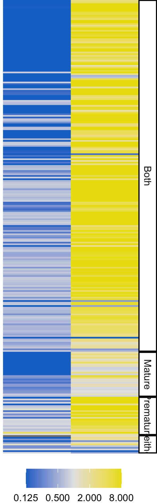

### Read Downsampling Data

```
downsample_raw = read.delim("shifted_specific2.txt", header=TRUE) %>%
                filter(Intron %in% curated$Intron) %>%
                separate(Intron, into=c("Gene", "Rank"), sep=";") %>%
                separate(Strain, into=c("Strain", "Condition"), sep='_')
downsample_raw$Strain = factor(downsample_raw$Strain, levels=c("scJS1", "scJS7"))
downsample_deseq = DESeq_analysis(data=downsample_raw, sizes=c(200000, 400000, 800000), seeds=c(1))
```

### Figure 1B

```
ma_layers = list(
    scale_x_continuous(trans='log10', name="Normalized Counts", breaks = c(.1, 1, 10, 100, 1000, 10000, 100000), limits=c(.1, 100000)),
    scale_color_manual(values=c('black', '#cb181d')),
    geom_hline(yintercept = 1, color='grey', linetype=2),
    geom_point()
    
high_mature = downsample_deseq %>% filter(Seed==1, Size==800000, Type=='Mature', !is.na(padj)) %>% mutate(Significant = padj < .05)
ggplot(high_mature, aes(x=baseMean, y=2^log2FoldChange, color=Significant)) + 
    ma_layers +
    scale_y_continuous(trans='log2', name="Fold Change", breaks = c(.001, .004, .016, .064, .25, 1, 2), limits=c(1/1200, 2), labels=scaleFUN)  
```

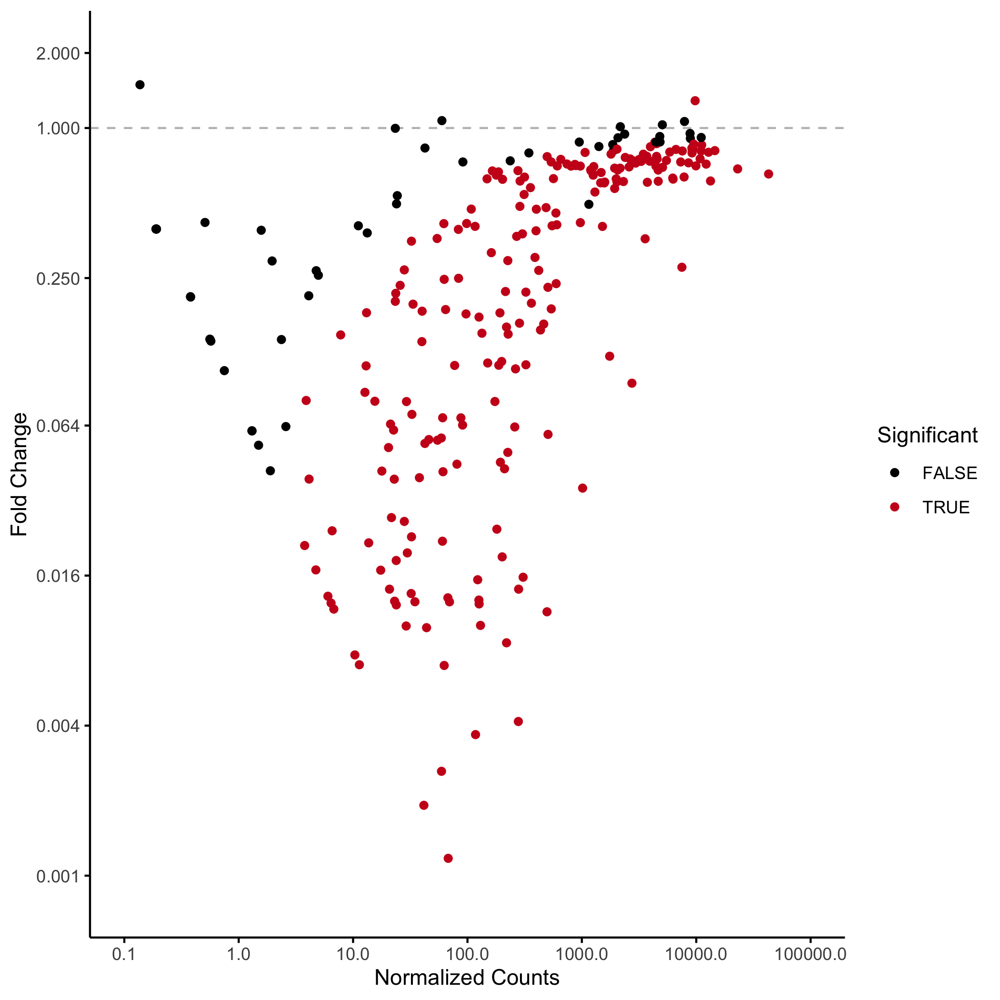

```
high_premature = downsample_deseq %>% filter(Seed==1, Size==800000, Type=='Premature', !is.na(padj)) %>% mutate(Significant = padj < .05)
ggplot(high_premature, aes(x=baseMean, y=2^log2FoldChange, color=Significant)) + 
    ma_layers +
    scale_y_continuous(trans='log2', name="Fold Change", breaks = c(.125, 1, 8, .064, 64), limits=c(.125, 64), labels=scaleFUN)
```
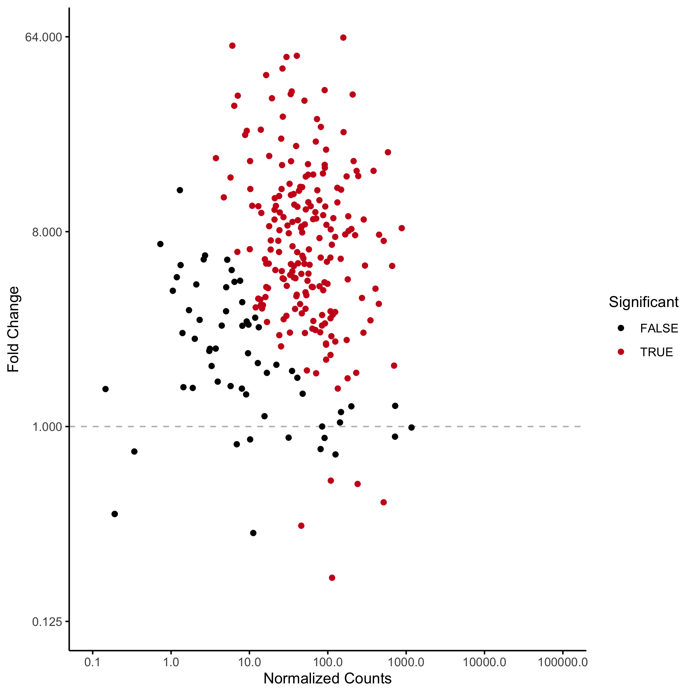

```
medium_mature = downsample_deseq %>% filter(Seed==1, Size==400000, Type=='Mature', !is.na(padj)) %>% mutate(Significant = padj < .05)
ggplot(medium_mature, aes(x=baseMean, y=2^log2FoldChange, color=Significant)) + 
    ma_layers +
    scale_y_continuous(trans='log2', name="Fold Change", breaks = c(.001, .004, .016, .064, .25, 1, 2), limits=c(1/1200, 2), labels=scaleFUN)
```
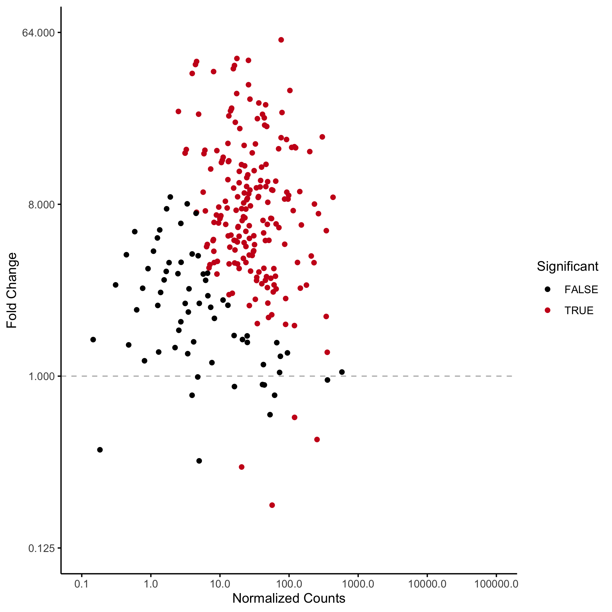

```
medium_premature = downsample_deseq %>% filter(Seed==1, Size==400000, Type=='Premature', !is.na(padj)) %>% mutate(Significant = padj < .05)
ggplot(medium_premature, aes(x=baseMean, y=2^log2FoldChange, color=Significant)) + 
    ma_layers +
    scale_y_continuous(trans='log2', name="Fold Change", breaks = c(.125, 1, 8, .064, 64), limits=c(.125, 64), labels=s
```


```
low_mature = downsample_deseq %>% filter(Seed==1, Size==200000, Type=='Mature', !is.na(padj)) %>% mutate(Significant = padj < .05)
ggplot(low_mature, aes(x=baseMean, y=2^log2FoldChange, color=Significant)) + 
    ma_layers +
    scale_y_continuous(trans='log2', name="Fold Change", breaks = c(.001, .004, .016, .064, .25, 1, 2), limits=c(1/1200, 2), labels=scaleFUN)
```
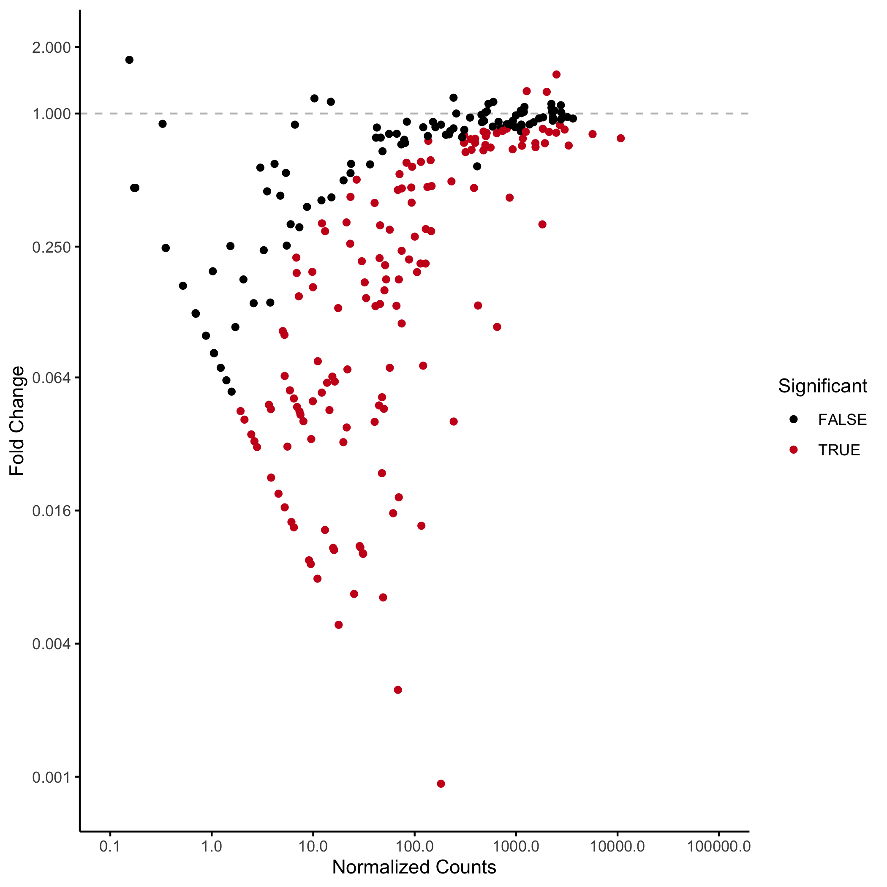

```
low_premature = downsample_deseq %>% filter(Seed==1, Size==200000, Type=='Premature', !is.na(padj)) %>% mutate(Significant = padj < .05)
ggplot(low_premature, aes(x=baseMean, y=2^log2FoldChange, color=Significant)) + 
    ma_layers +
    scale_y_continuous(trans='log2', name="Fold Change", breaks = c(.125, 1, 8, .064, 64), limits=c(.125, 64), labels=scaleFUN)
```
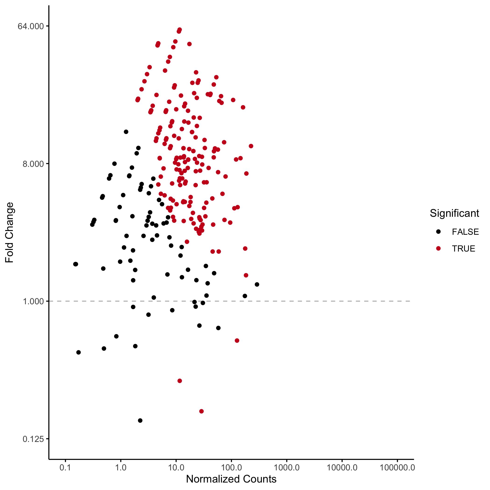

#### Count Significant Events

```
downsample_deseq %>% filter(Seed==1, padj<.05) %>%
            group_by(Type, Size) %>%
            summarise(count=n()) %>%
            dcast(Size ~ Type, value.var="count") %>%
            arrange(desc(Size))
```

### Figure 1C

```
boxplot_data = downsample_deseq %>% filter(Seed==1) %>%
    dcast(Gene+Rank+Size ~ Type, value.var='padj') %>%
    mutate(Significant = case_when(is.na(Premature) & Mature < .05 ~ "Significant",
                                   is.na(Mature) & Premature < .05 ~ "Significant",
                                   Mature < .05 & Premature < .05 ~ "Significant",
                                   TRUE ~ "Non-Significant")) %>%
   unite(Intron, c(Gene, Rank), sep=';') %>%
   merge(intron_properties, by='Intron') %>%
   select(Intron, Size, Significant, three_score, intron_length)
   
boxplot_data$Size = factor(boxplot_data$Size, levels=c("800000", "400000", "200000"))
boxplot_data$Significant = factor(boxplot_data$Significant, levels=c("Significant", "Non-Significant"))

intron_length_boxplot =ggplot(boxplot_data, aes(x=Significant, y=intron_length, color=Significant)) +
    facet_grid(~Size) +
    theme(axis.ticks.x = element_blank(),
          axis.text.x = element_blank(),
          axis.title.x = element_blank(),
          axis.line.x = element_blank(),
          strip.background = element_blank()) +
    scale_color_manual(values=c("#cb181d", "black")) +
    scale_y_continuous(trans='log10', limits=c(50,1100), breaks=c(100, 500, 1000), name="Intron Length") +
    geom_quasirandom()
    
wilcox.test(intron_length ~ Significant, data=boxplot_data %>% filter(Size==800000), alternative='less')
wilcox.test(intron_length ~ Significant, data=boxplot_data %>% filter(Size==400000), alternative='less')
wilcox.test(intron_length ~ Significant, data=boxplot_data %>% filter(Size==200000), alternative='less')
```
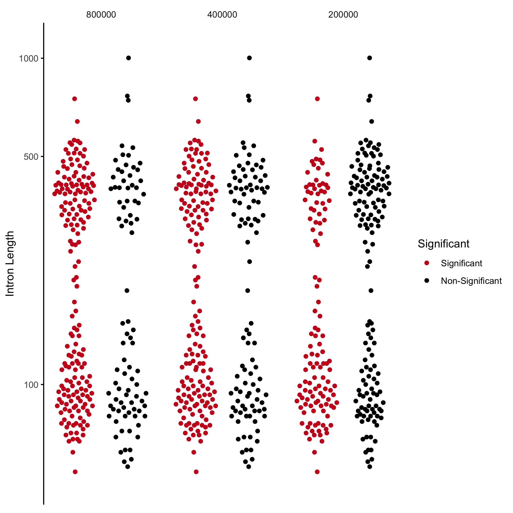

### Figure 1D
```
quasirandom_layers = list(
  theme(axis.title = element_blank(),
        axis.ticks.x = element_blank(),
        axis.line.x = element_blank(),
        plot.margin = margin(0,0,0,0),
        legend.position = 'none'),
  scale_alpha_manual(values=c(0, 1)),
  geom_quasirandom(color='#cb181d')

fold_change_high = downsample_deseq %>% filter(Seed==1) %>% dcast(Gene+Rank+Size~Type, value.var="log2FoldChange") %>% unite(Intron, c(Gene, Rank), sep=';') %>% filter(Size==800000) %>% select(-Size) %>% mutate(SI_ratio = Premature-Mature)

significant = downsample_deseq %>% filter(Seed==1) %>%
    dcast(Gene+Rank+Size ~ Type, value.var='padj') %>%
    mutate(Significant = case_when(is.na(Premature) & is.na(Mature) ~ "Non-Significant",
                                   is.na(Premature) & Mature < .05 ~ "Significant",
                                   is.na(Mature) & Premature < .05 ~ "Significant",
                                   Mature < .05 & Premature < .05 ~ "Significant",
                                   TRUE ~ "Non-Significant")) %>%
    select(-Premature, -Mature) %>%
    unite(Intron, c(Gene,Rank), sep=';') %>%
    merge(fold_change_high, by="Intron") %>%
    merge(mpe_expression, by="Intron")

significant$Size = factor(significant$Size, levels=c("800000", "400000", "200000")) 

high_count = nrow((significant %>% filter(Size==800000, Significant=='Significant')))
medium_count = nrow((significant %>% filter(Size==400000, Significant=='Significant')))
low_count = nrow((significant %>% filter(Size==200000, Significant=='Significant')))

ggplot(significant, aes(x=Size, y=2^Mature, alpha=Significant)) +
  scale_y_continuous(trans='log2', limits=c(1/128, 2), breaks=c(.008, .032, .125, .5, 1, 2)) +
  geom_hline(yintercept = 1, color='grey', linetype=2) +
  quasirandom_layers
  
wilcox.test((significant %>% filter(Size==800000, Significant=='Significant'))$Mature, (significant %>% filter(Size==400000, Significant=='Significant'))$Mature, alternative='two.sided')
wilcox.test((significant %>% filter(Size==800000, Significant=='Significant'))$Mature, (significant %>% filter(Size==200000, Significant=='Significant'))$Mature, alternative='two.sided')
```

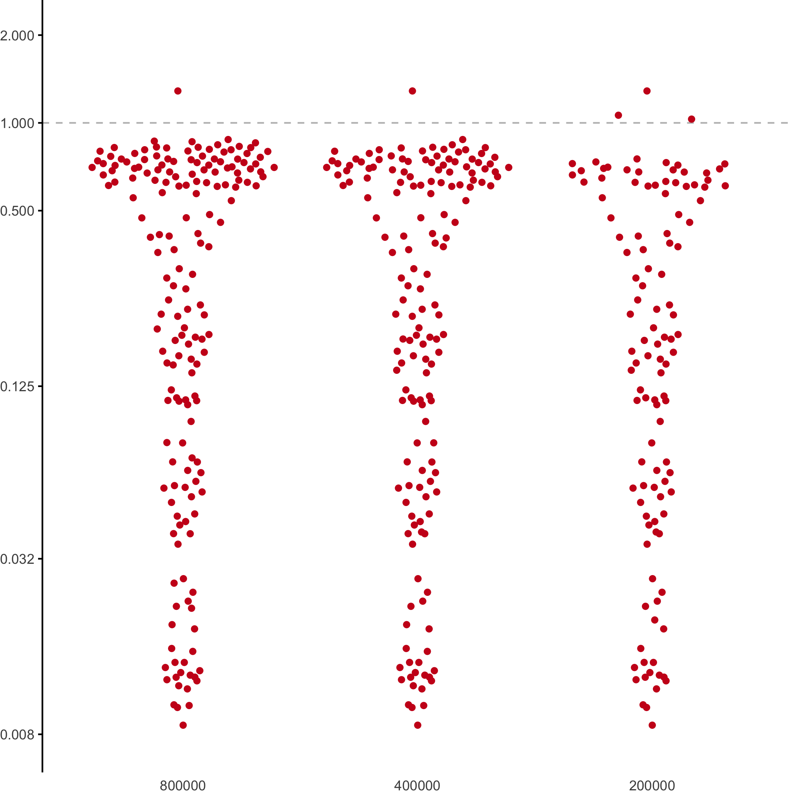

```
ggplot(significant, aes(x=Size, y=2^Premature, alpha=Significant)) +
    scale_y_continuous(trans='log2', breaks=c(.016, .125, 1, 8, 64)) +
    geom_hline(yintercept = 1, color='grey', linetype=2) +
    quasirandom_layers
               
wilcox.test((significant %>% filter(Size==800000, Significant=='Significant'))$Premature, (significant %>% filter(Size==400000, Significant=='Significant'))$Premature, alternative='two.sided')
wilcox.test((significant %>% filter(Size==800000, Significant=='Significant'))$Premature, (significant %>% filter(Size==200000, Significant=='Significant'))$Premature, alternative='two.sided')
```
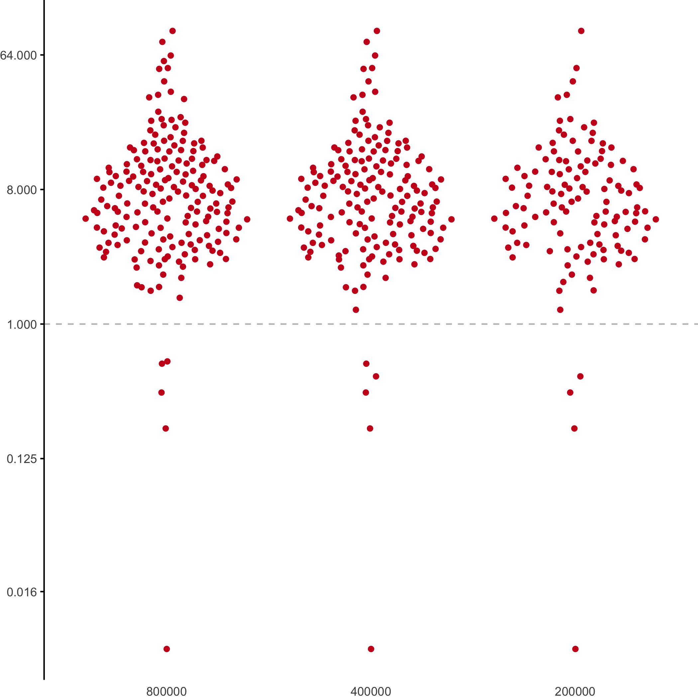


```
ggplot(significant, aes(x=Size, y=Mature_Average, alpha=Significant)) +
    scale_y_continuous(trans='log10', breaks=c(.1, 1, 10, 100, 1000, 10000, 100000)) +
    quasirandom_layers
    
wilcox.test((significant %>% filter(Size==800000, Significant=='Significant'))$Mature_Average, (significant %>% filter(Size==400000, Significant=='Significant'))$Mature_Average, alternative='less')
wilcox.test((significant %>% filter(Size==800000, Significant=='Significant'))$Mature_Average, (significant %>% filter(Size==200000, Significant=='Significant'))$Mature_Average, alternative='less')
```
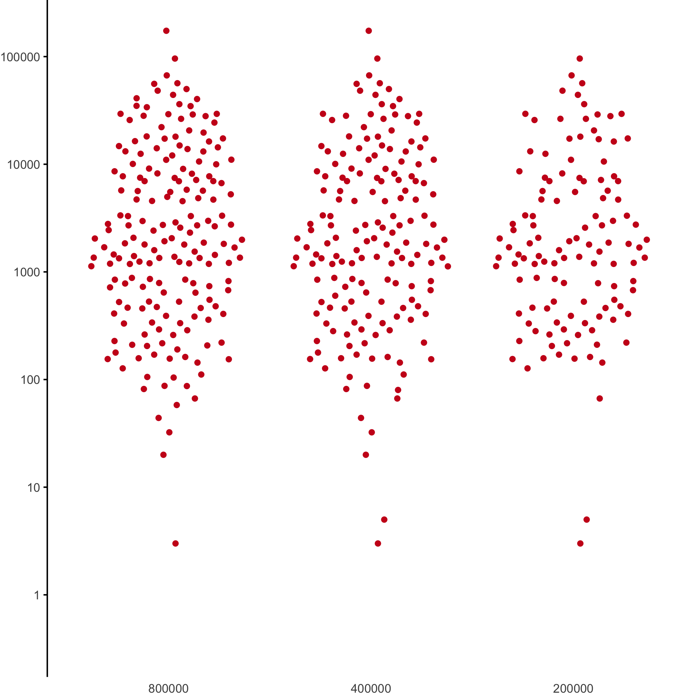

```
ggplot(significant, aes(x=Size, y=Premature_Average, alpha=Significant)) +
    scale_y_continuous(trans='log10', breaks=c(.1, 1, 10, 100, 1000)) +
    quasirandom_layers
               
wilcox.test((significant %>% filter(Size==800000, Significant=='Significant'))$Premature_Average, (significant %>% filter(Size==400000, Significant=='Significant'))$Premature_Average, alternative='less')
wilcox.test((significant %>% filter(Size==800000, Significant=='Significant'))$Premature_Average, (significant %>% filter(Size==200000, Significant=='Significant'))$Premature_Average, alternative='less')
```
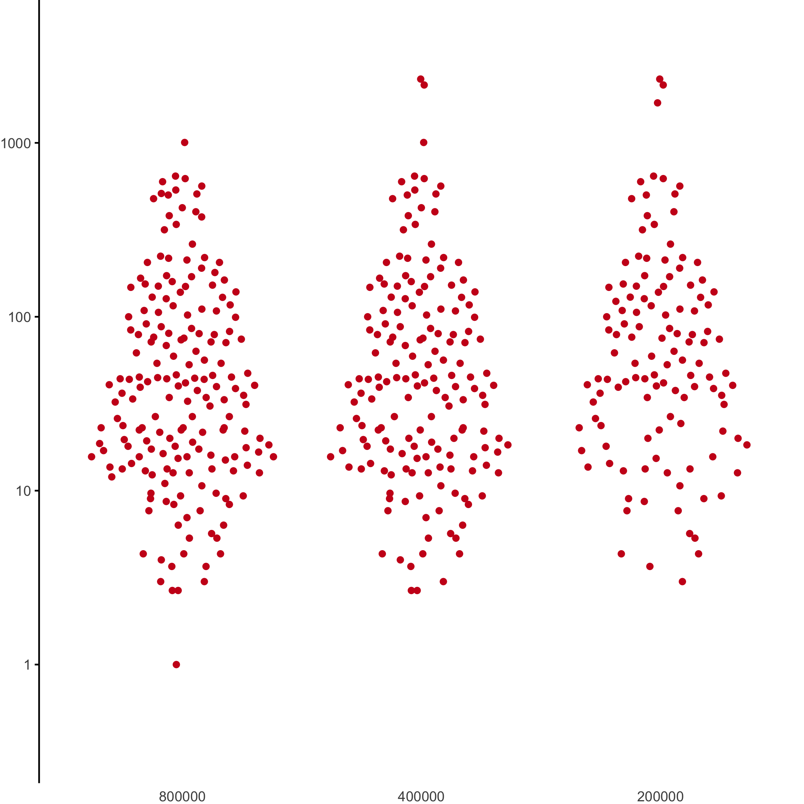

